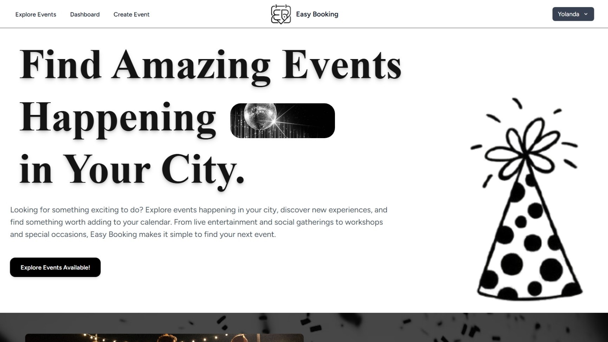

# EasyBooking



EasyBooking is a responsive event booking and management platform designed to make it easier for organisers to create and manage events while giving attendees a simple way to discover and book events.

## Features

* Event browsing and discovery
* Event booking and registration
* Event management for organisers
* Responsive design for desktop and mobile devices
* User-friendly booking experience
* Structured event information and management

## Tech Stack

* HTML
* CSS
* JavaScript
* PHP
* Laravel
* MySQL
* Bootstrap
* Tailwind CSS
* Vite

## Project Structure

```text
easybooking/
├── app/
├── database/
├── public/
├── resources/
├── routes/
├── storage/
├── tests/
└── ...
```

## Getting Started

### Requirements

* PHP
* Composer
* Node.js and npm
* MySQL

### Installation

```bash
git clone https://github.com/YolandaMbande/easybooking.git
cd easybooking
composer install
npm install
```

Create your environment file:

```bash
cp .env.example .env
```

Generate the application key:


php artisan key:generate


Configure your database connection in `.env`, then run:

bash
php artisan migrate


Build the frontend:

bash
npm run build


Start the development server:

bash
php artisan serve


For frontend development:

bash
npm run dev


## Project Preview

**Live Demo:** TBA

## Purpose

This project was created as a web development project to explore the design and development of an event booking platform, including responsive interfaces, event management functionality, and user booking workflows.

## Author

**Yolanda Mbande**

* GitHub: [YolandaMbande](https://github.com/YolandaMbande)
* LinkedIn: [Yolanda Mbande](https://www.linkedin.com/in/yolanda-mbande/)

## License

This project is available for educational and portfolio purposes.
